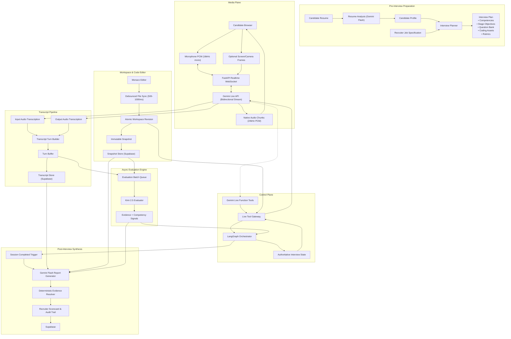

# Vetra AI Technical Interviewer — System Architecture & Implementation Plan (v3)

## 1. Core Architectural Pillars & Authority Model

| Component | Role | Authority |
| :--- | :--- | :--- |
| 🎙️ **Gemini Live** | Real-time interviewer voice, listening, speaking, interruption handling | **Conversation Authority** ("How do I say it?") |
| 🧠 **Kimi** | Deep evaluation, evidence interpretation, probing objectives | **Reasoning & Evaluation Authority** ("What does this mean?") |
| ⚡ **Gemini Flash** | Resume/plan generation, interview assets, final report synthesis | **Generation Authority** |
| 🔄 **LangGraph** | Interview state, stage progression, orchestration, guard rails | **Workflow Authority** ("What stage are we in?") |
| 🗄️ **Backend / Supabase** | Persistence, revisions, snapshots, transcript IDs, validation | **Data & Evidence Authority** ("What is true?") |
| 🔌 **Live Tool Gateway** | Controlled interface between Gemini Live and domain services | **Action Boundary** |

### Guiding Principles
- **Separation of Concerns:** *Gemini Live talks. Kimi evaluates. LangGraph controls. Backend verifies.*
- **Action Boundary:** Gemini Live **never** directly mutates authoritative interview state. It requests actions through function calls; backend domain services and LangGraph determine validity.
- **Asynchronous Decoupling:** Kimi never blocks the realtime audio path. Gemini Live maintains low-latency voice turns while Kimi processes buffered evidence asynchronously.
- **Single Source of Truth:** Gemini's internal context window is a transient conversational buffer; Supabase/Postgres is the immutable source of truth.

---

## 2. System Architecture



---

## 3. Gemini Live Integration Model

### Model Selection
- **Primary Live Models:** `gemini-3.1-flash-live-preview` and `gemini-2.5-flash-native-audio-preview-12-2025`.
- **Capabilities Utilized:** Native Audio streaming, Input/Output Audio Transcription, Bidirectional WebSockets, Function Calling, Session Resumption, and Context Window Compression.

### Session Lifecycle & Transport Adapter
The backend establishes a bidirectional session via the Google GenAI SDK:
```python
async with client.aio.live.connect(
    model="gemini-3.1-flash-live-preview", # or gemini-2.5-flash-native-audio-preview-12-2025
    config=live_config
) as session:
    # Continuous event loop - does NOT terminate on turn_complete
    async for response in session.receive():
        if response.server_content:
            await handle_server_content(response.server_content)
        elif response.tool_call:
            await handle_tool_call(response.tool_call)
        elif response.session_resumption_update:
            await handle_session_resumption(response.session_resumption_update)
        elif response.go_away:
            await handle_go_away(response.go_away)
```

### Complete Live Connect Configuration
```python
config = types.LiveConnectConfig(
    response_modalities=["AUDIO"],
    speech_config=types.SpeechConfig(
        voice_config=types.VoiceConfig(
            prebuilt_voice_config=types.PrebuiltVoiceConfig(
                voice_name="Kore"  # Clear, professional tone
            )
        )
    ),
    system_instruction=types.Content(
        parts=[types.Part.from_text(INTERVIEWER_SYSTEM_PROMPT)]
    ),
    input_audio_transcription={},
    output_audio_transcription={},
    realtime_input_config=types.RealtimeInputConfig(
        automatic_activity_detection=types.AutomaticActivityDetection(
            disabled=False,
            speech_start_sensitivity=types.SpeechStartSensitivity.DEFAULT,
            speech_end_sensitivity=types.SpeechEndSensitivity.DEFAULT,
            silence_duration_ms=1200,  # Tuned for natural candidate thinking pauses
            prefix_padding_ms=300
        )
    ),
    session_resumption=types.SessionResumptionConfig(),
    context_window_compression=types.ContextWindowCompressionConfig(
        sliding_window=types.SlidingWindowConfig()
    ),
    tools=[INTERVIEWER_TOOL_DECLARATIONS]
)
```

---

## 4. Realtime Media Plane & Event Protocols

### Audio Specifications
- **Candidate Microphone Input:** 16-bit PCM, 16 kHz, Mono, Little-Endian, streamed in ~100 ms chunks from browser `AudioWorklet` via WebSocket.
- **Interviewer Audio Output:** 24 kHz Native PCM chunks received from Gemini Live, forwarded over WebSocket for Web Audio API playback.

### VAD & Native Barge-In (Interruption Model)
- Automatic Voice Activity Detection (VAD) is enabled with tuned silence thresholds (1.2s) allowing thinking pauses.
- Interruption (`interrupted == true`) triggers immediate browser playback cutoff and drains pending audio buffers.

### Internal Realtime Event Protocol
```
GEMINI_STARTED_SPEAKING     -> Browser audio stream opens
GEMINI_AUDIO_CHUNK          -> Raw PCM stream forwarded
CANDIDATE_STARTED_SPEAKING  -> Client speech detected
CANDIDATE_TURN_COMPLETE     -> Client pause/turn completed
GEMINI_INTERRUPTED          -> Barge-in event, drop playback buffer
GEMINI_TURN_COMPLETE        -> Model finished current speaking turn
TOOL_CALL                   -> Gemini requests external domain tool
TOOL_RESPONSE               -> Backend gateway returns payload
SESSION_RESUMPTION_UPDATE   -> New resume handle persisted to Redis/DB
GO_AWAY                     -> Connection draining warning from server
```

---

## 5. Tool Gateway & Tool Design

Gemini Live invokes tools dynamically. The tool gateway dispatches requests to domain services rather than a monolithic handler.

```
Gemini Live ──(Tool Request)──> Tool Gateway
                                     ├──> InterviewStateService ──> LangGraph State
                                     ├──> WorkspaceService      ──> Revision / Snapshot Store
                                     └──> ProblemService        ──> Coding Bank & Guardrails
```

### Core Tool Definitions

1. `get_interviewer_state` *(Read-Only)*
   - **Trigger:** When Gemini needs current interview stage, target competencies, or pending probing objectives.
   - **Response Payload:**
     ```json
     {
       "stage": "TECH_QA",
       "guidance_version": 8,
       "priority": "HIGH",
       "topic": "transaction_isolation",
       "goal": "Assess understanding of concurrency anomalies (phantom reads vs dirty reads)",
       "transition_hint": "Probe deeper if candidate mentions locking",
       "coverage": { "system_design": 0.75, "databases": 0.40 },
       "pending_objectives": ["isolation_levels", "deadlock_prevention"]
     }
     ```

2. `request_stage_transition` *(Action / Request-Only)*
   - **Trigger:** When Gemini believes current stage objectives are fulfilled.
   - **Behavior:** LangGraph validates transition guards (minimum question count, competency coverage). Rejects transition if conditions unmet; returns approved stage if valid.

3. `get_workspace_context` *(Read-Only)*
   - **Trigger:** During coding stage when discussing candidate's code.
   - **Payload:** Active file path, syntax error summary, semantic code summary, and latest snapshot diff (prevents dumping entire repository into context).

4. `present_problem` *(Action Tool)*
   - **Trigger:** Transition into coding stage.
   - **Validation:** Enforces `stage == CODING`, `active_problem_id == None`, `problem_presented == False`.
   - **Payload:** Problem statement, boilerplate files, test case descriptions.

5. `record_interviewer_observation` *(Lightweight Action)*
   - **Trigger:** Instant conversational flags (e.g., self-corrections, critical slips).
   - **Payload:** Short observation string, associated turn IDs, competency tag.

---

## 6. Asynchronous Kimi Evaluation Engine

### Architectural Decoupling
Kimi runs in an **eventually consistent, asynchronous evaluation loop** to guarantee zero latency on the voice plane:
- Candidate speech turns and code snapshots are batched into the `Evaluation Queue` (every 3–5 turns or significant snapshot).
- Kimi evaluates the batch against candidate history and rubrics.
- Produces structured evidence signals and updates LangGraph guidance.

```
Transcript Turns (41..45) + Snapshot (snap_038)
                   │
                   ▼
         [ Evaluation Queue ]
                   │
                   ▼
         [ Kimi 2.5 Evaluator ]
                   │
                   ▼
       { Competency Signals & Probing Objectives }
                   │
                   ▼
          [ LangGraph State ]
                   │
                   ▼
       (Updated latest_guidance)
                   │
         [ Gemini Live ] <── calls get_interviewer_state()
```

### Objective Guidance (Not Scripting)
Kimi outputs high-level strategic objectives rather than exact scripted sentences:
```json
{
  "priority": "HIGH",
  "competency": "database_concurrency",
  "objective": "Determine whether candidate understands isolation anomalies",
  "reason": "Candidate mentioned indexing but omitted concurrency anomalies under concurrent writes",
  "suggested_direction": "Probe transaction isolation and repeatable read semantics"
}
```
Gemini Live naturally phrases the question in conversational tone:
> *"You mentioned indexes helping with query performance. Let's stay with databases for a moment: how would you handle two concurrent transactions modifying the same record simultaneously?"*

### Deterministic Evidence Resolution
- Transcript turns are assigned server-authoritative sequential IDs: `turn_001`, `turn_002`, `turn_043`.
- Kimi links signals to turn IDs:
  ```json
  {
    "competency": "distributed_systems",
    "signal": "positive",
    "strength": 0.88,
    "supporting_turn_ids": ["turn_043", "turn_047"]
  }
  ```
- Post-interview report generator resolves `turn_043` directly from Supabase, preventing hallucinations.

---

## 7. Workspace Architecture & Code Synchronization

- **Monaco Editor Integration:** Frontend debounces keystrokes (500–1000 ms) and pushes atomic workspace revisions (`rev_047`, `rev_048`).
- **Immutable Snapshots:** Major milestones or test executions generate immutable snapshots (`snap_038`) containing full file trees.
- **Evaluation Consistency:** Kimi evaluates against frozen `snap_038` while the candidate continues writing in `rev_049+`, eliminating race conditions.

---

## 8. State Separation Model

```
                          ┌───────────────────────────┐
                          │    VETRA STATE DOMAINS    │
                          └─────────────┬─────────────┘
                                        │
     ┌──────────────────────────┼──────────────────────────┐
     ▼                          ▼                          ▼
[ Authoritative State ]    [ Derived Evaluation ]     [ Realtime State ]
• session_id               • competency_signals       • gemini_session_id
• stage (TECH_QA, CODING)  • evidence_records         • resume_handle
• stage_started_at         • strengths / weaknesses   • is_resumable
• question_count           • confidence_scores        • connection_status
• required_objectives      • pending_probes           • candidate_speaking
• guidance_version         • coverage_matrix          • gemini_speaking
• latest_snapshot_id
```

---

## 9. Session Resumption & Resilience

- **Session Resumption:** Gemini Live issues `session_resumption_update` events containing handles. The backend persists the latest valid handle to Redis/Postgres.
- **Auto-Recovery:** If the WebSocket drops, the client reconnects to FastAPI, which triggers `session.resume(handle)` without losing conversational context.
- **Session Limits:** Audio-only sessions have a 15-minute operational limit; for full 45–60 min interviews, the backend orchestrates transparent session rollover using persisted LangGraph state and resumption checkpoints.
- **Security:** The Gemini API key remains strictly server-side inside FastAPI; the browser interacts solely with Vetra's authenticated WebSocket.

---

## 10. Backend File & Directory Structure

```
backend/
└── src/
    ├── api/
    │   ├── routes/
    │   │   ├── resume.py            # Resume upload & parsing endpoints
    │   │   ├── interview.py         # Session management & lifecycle routes
    │   │   ├── workspace.py         # Code execution & file workspace endpoints
    │   │   └── websocket.py         # Client media bridge WebSocket handler
    │   └── dependencies.py          # FastAPI auth and dependency injection
    ├── realtime/
    │   ├── gemini_live.py           # Gemini Live SDK client & stream handler
    │   ├── session_manager.py       # Session lifecycle, resumption & recovery
    │   ├── audio_bridge.py          # PCM audio chunking & format conversion
    │   ├── event_router.py          # Event dispatch (barge-in, turns, transcript)
    │   └── schemas.py               # Realtime protocol payload schemas
    ├── orchestration/
    │   ├── graph.py                 # LangGraph workflow definition
    │   ├── state.py                 # Authoritative interview state schemas
    │   ├── guards.py                # Stage transition validation rules
    │   └── transitions.py           # State machine transition handlers
    ├── agents/
    │   ├── kimi/
    │   │   ├── client.py            # Moonshot / Kimi API client
    │   │   ├── evaluator.py         # Batch evaluation logic & prompt templates
    │   │   └── schemas.py           # Evaluation & competency signal models
    │   ├── resume/
    │   │   └── parser.py            # Gemini Flash resume extraction
    │   ├── planner/
    │   │   └── planner.py           # Interview plan & rubric generator
    │   └── report/
    │       └── generator.py         # Final scorecard & evidence synthesizer
    ├── tools/
    │   ├── definitions.py           # Gemini Live tool declarations
    │   ├── gateway.py               # Tool execution router & dispatcher
    │   ├── interview_tools.py       # State, stage, & observation handlers
    │   └── workspace_tools.py       # Workspace context & problem handlers
    ├── services/
    │   ├── transcript.py            # Transcript turn builder & persistence
    │   ├── interview.py             # Interview business logic & session store
    │   ├── workspace.py             # Monaco sync & revision manager
    │   ├── snapshot.py              # Snapshot generator & retrieval
    │   ├── evaluation_queue.py      # Async batch queue for Kimi
    │   ├── evidence.py              # Evidence resolver & audit trail
    │   └── report.py                # Scorecard compilation service
    ├── models/
    │   ├── interview.py             # SQLAlchemy/Pydantic interview models
    │   ├── transcript.py            # Transcript turn & speaker schemas
    │   ├── workspace.py             # Workspace revision & snapshot models
    │   ├── evaluation.py            # Competency & signal schemas
    │   └── evidence.py              # Supporting evidence models
    └── db/
        ├── supabase.py              # Supabase / PostgreSQL client
        └── repositories/            # Data access layer for entities
```

---

## 11. Verification & MVP Roadmap

### Milestone 1: Live Voice & Transcription Bridge (15-min MVP)
- Establish FastAPI ↔ Gemini Live bidirectional audio pipe (PCM 16kHz mono).
- Verify native barge-in handling and browser playback interruption.
- Capture `input_audio_transcription` and `output_audio_transcription` into structured `TranscriptTurn` entities with sequential IDs.

### Milestone 2: Tool Gateway & LangGraph State
- Wire `get_interviewer_state` and `request_stage_transition` to LangGraph state machine.
- Verify that Gemini queries state dynamically and adapts conversation without state corruption.

### Milestone 3: Asynchronous Kimi Evaluation
- Connect transcript buffer and snapshot trigger to evaluation batch queue.
- Validate that Kimi returns structured competency signals linked to `turn_id`s without delaying audio turns.
- Test guidance injection into LangGraph and subsequent Gemini state fetch.

### Milestone 4: Workspace Synchronization & Snapshots
- Integrate Monaco editor with debounced file sync.
- Generate immutable snapshots and attach to evaluation batches.

### Milestone 5: Post-Interview Scorecard Generation
- Trigger post-interview report synthesis via Gemini Flash.
- Verify deterministic resolution of turn IDs against the Supabase transcript store.
